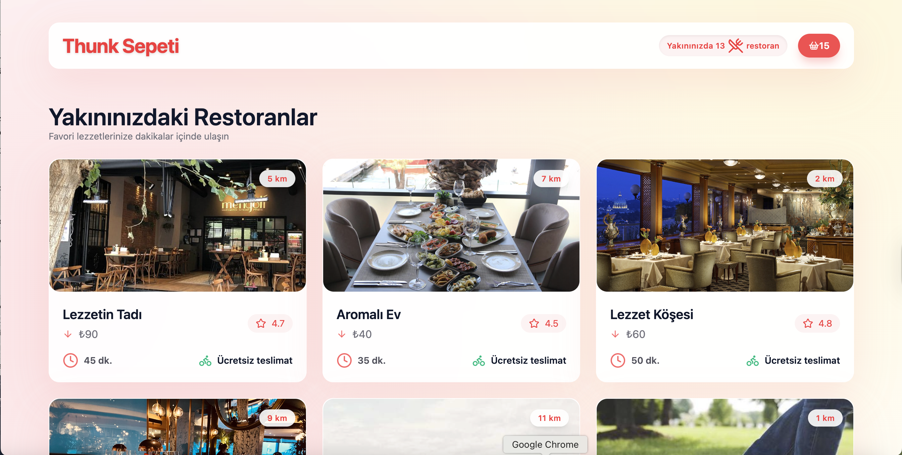

# 🍽️ Yemek Sepeti Clone

**Yemek Sepeti Clone**, React + Redux Thunk kullanılarak geliştirilmiş bir **online yemek siparişi uygulamasıdır**. Kullanıcılar restoranları görüntüleyip menüden ürün seçebilir ve sepetlerini yönetebilir.

---

## ⚡ Özellikler

- Restoranları listeleme ve filtreleme  
- Menü detaylarını görüntüleme  
- Sepete ürün ekleme/çıkarma  
- Responsive tasarım (mobil & desktop)

---

## 🛠️ Teknolojiler

React, Redux, Redux Thunk, Axios, CSS / Tailwind, JSON Server (mock backend), Vite,uuid  

---

## 💻 Kurulum

git clone https://github.com/Rumeysapat/yemek-sepeti-clone.git 
cd yemek-sepeti-clone 
npm install 
npx json-server --watch db.json --port 4000   # Mock backend 
npm run dev

---

## 💻 Resimler

  
  
  

---
## 💻 Demo

  

